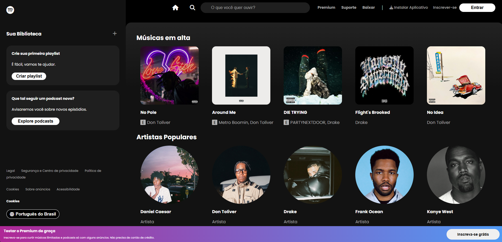

# Spotify UI Clone

Este projeto é um clone visual da interface principal do Spotify, criado com foco em **HTML5**, **CSS3** (Flexbox) e **JavaScript** puro.

**Nota:** Este é um projeto de front-end para estudo. Ele não se conecta à API do Spotify; todos os dados de músicas e artistas são simulados no JavaScript.

---

### Prévia

---

### Funcionalidades

* **Conteúdo Dinâmico:** Os cards de músicas e artistas são gerados dinamicamente via JavaScript a partir de arrays.
* **Scroll Horizontal:** As seções de cards podem ser roladas horizontalmente usando a rodinha do mouse (scroll wheel).
* **Interface Reativa:** Efeitos de *hover* nos cards (como o botão "Play") e links, seguindo a identidade visual do Spotify.
* **Layout Fiel:** Recriação da estrutura de duas colunas (sidebar fixa e conteúdo principal rolável) usando Flexbox.

---

### Tecnologias Utilizadas

* **HTML5** (Estrutura semântica)
* **CSS3** (Estilização, Flexbox, Animações)
* **JavaScript (ES6+)** (Manipulação do DOM, Event Listeners)

---

### Como Executar

Por ser um projeto puramente front-end, basta:

1.  Ter todos os arquivos (`index.html`, `style.css`, `script.js` e a pasta `images/`) no mesmo diretório.
2.  Abrir o arquivo `index.html` em qualquer navegador web.
